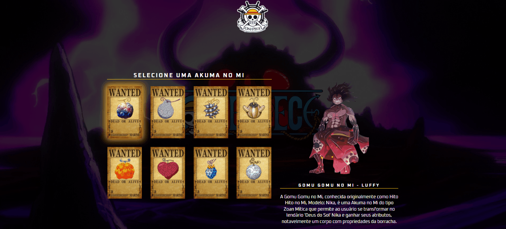

<h1 align="center">One Piece - Akuma no mi selection</h1>
<br>

<p align="center">Meu primeiro projeto autoral 😊</p> 
<br>

<div>
    <h3 align="center"><strong>Desktop View</strong><h3>
    <a href="https://thaleshng.github.io/one-piece-akuma-no-mi-selection/" target="_blank"></a> 
</div>

<div align="center">
    <h3 align="center"><strong>Mobile View</strong><h3>
    <a href="https://thaleshng.github.io/one-piece-akuma-no-mi-selection/" target="_blank"></a> 
</div>

<div align="center">
    
    
    
    <br>
    
    <br>
    
</div>

<br>


<div align="center">
    <a href="#tecnologias-utilizadas">Tecnologias Utilizadas</a> •
    <a href="#finalidade-do-projeto">Finalidade do Projeto</a> •
    <a href="#dificuldades-encontradas-e-aprendizados">Dificuldades Encontradas e Aprendizados</a> •
    <a href="#como-ter-acesso-ao-código">Como ter acesso ao Código</a>
</div>

<br>
<br>

<h2 align="center">Tecnologias Utilizadas</h2>
<br>

[](https://www.devmedia.com.br/o-que-e-o-html5/25820)
<br>
<br>

[](https://kenzie.com.br/blog/css3/)
<br>
<br>

[](https://blog.betrybe.com/javascript/)
<br>
<br>
<br>
<br>

<h2 align="center">Finalidade do Projeto</h2>
<br>

<p> O projeto em questão tem como finalidade listar alguns elementos do universo de One Piece com algumas informações de personagens vinculados à tais elementos.</p> 
<p> Foi baseado no projeto de um evento para pessoas que sabiam pouco sobre programação, a fim de demonstrar um pouco da área, para talvez despertar o interesse de programar, porém, com uma temática diferente (x-men).</p>
<p> Entretanto, por eu estar fazendo um curso de programação com mentoria, aproveitei para praticar minhas habilidades e fiz o projeto com outra temática (One Piece).</p>
<br>
<br>
<br>
<br>

<h2 align="center">Dificuldades Encontradas e Aprendizados</h2>
<br>

<p> Por ser o primeiro projeto autoral que eu fiz usando JavaScript antes de entrar mais fundo no módulo de JavaScript do curso, tive um pouco de dificuldades quanto ao código.</p>
<p> Após estudar e pesquisar um pouco, consegui finalizar a parte de JavaScript sem maiores problemas, o que me animou bastante a começar o quanto antes a estudar os módulos de JavaScript do curso.
<p>Aprendi um pouco mais sobre o conceito de Arrow Functions, além de algumas outras proprieades como: 'addEventListener', 'getElementById', 'data-name', entre outras. Além de aprender a usar o 'refatorar' pra refatorar o código dentro do próprio VS Code.</p>
<br>
<br>
<br>
<br>

<h2 align="center">Como ter acesso ao Código<h2>
<br>

### Pré-requisitos:
<br>
Antes de começar, vai precisar ter instalado na sua máquina as seguintes ferramentas:
<br>
<br>

[Git Bash](https://git-scm.com)

[VS Code](https://code.visualstudio.com)
<br>
<br>

Clone este repositório com o Git Bash:
```
git clone https://github.com/thaleshng/one-piece-akuma-no-mi-selection.git
```
Entra na pasta que foi criada e abra com o Visual Studio Code.


